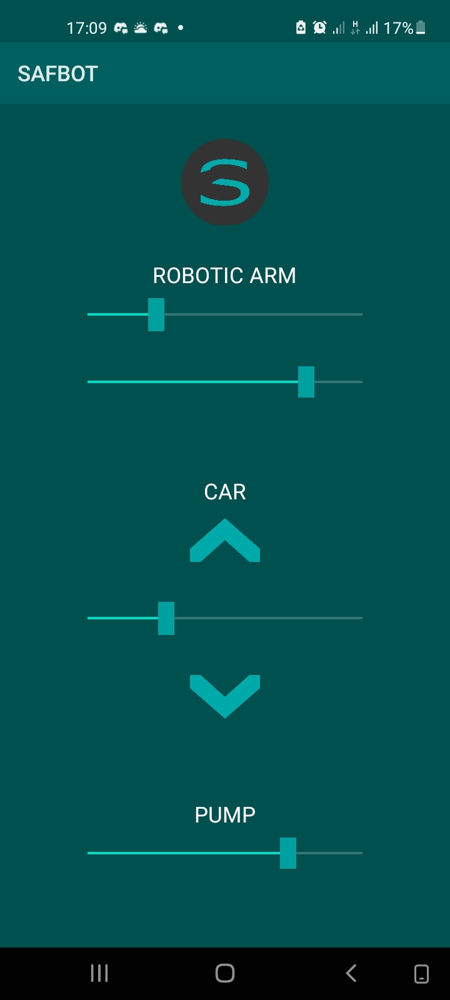

# Hi there, I'm Abiodun! 👋

Welcome to my GitHub profile! I'm a Computer Engineer with a strong focus on graphics programming, game development, and high-performance rendering. Below, you'll find an overview of my work and personal projects.

## 🔭 Featured Projects

### 🚀 [Vulkan Realtime Rendering Engine](https://github.com/nahiim/hdx)
A Vulkan-based 3D engine with advanced features such as PBR, particle systems, fluid and cloth simulations, and skybox rendering. Designed for high-performance and scalability, Hydroxy is a playground for experimenting with the latest graphics techniques.

- **Key Features**: 
  - Physically Based Rendering (PBR)
  - Image Based Lighing
  - Compute Shaders for simulations and map generation
  - Instanced Rendering

### 🎮 [OpenGL Game Engine](https://github.com/nahiim/obsidion)
A custom game engine built using OpenGL, featuring Box2D physics, 3D animation skinning, and sound integration with OpenAL. It was developed to create games for various game jams and personal projects.

- **Key Features**:
  - Box2D Physics
  - 3D Animation Skinning
  - Sound system with OpenAL
  - Normal mapping
  - Procedural Terrain

<table style="border: none;" height="500">
  <tr>    
    <td style="width: 25%; height: 50% border: none;">
      
    </td>
    <td style="width: 75%; border: none;">
      
    </td>
  </tr>
</table>

### 🎮 [Smartphone controlled vehicle with robotic arm(SAFBOT)](https://github.com/nahiim/fire-robot)
This project integrates an ESP32 microcontroller, a robotic arm, and a water pump into a compact vehicle that can be remotely controlled via a mobile Android app.

- **Key Features**:
  - Remote Vehicle Control: Users can move the vehicle in any direction and adjust its speed via the Android app.
  - Pump Operation: The app allows for the control of the water pump, enabling users to manage the intensity of the firefighting operation.
  - Robotic Arm Manipulation: The arm can be precisely controlled, allowing for accurate targeting of the water spray, including the ability to rotate and extend the arm.

- **Technology Stack**
  - ESP32 Microcontroller: Manages the hardware components and Wi-Fi communication.
  - Java (Android App): Provides the interface and logic for user interaction, communicating with the ESP32 via the Volley library.
  - Servo Motors: Used in the robotic arm for accurate movement.
  - Wi-Fi: Facilitates communication between the Android app and the ESP32 microcontroller.

## 📫 Get in Touch

Feel free to explore my repositories, and if you have any questions or want to collaborate, don't hesitate to reach out!

- [Email](mailto:yynahim@gmail.com)
- [LinkedIn](https://linkedin.com/in/abiodun3D)
